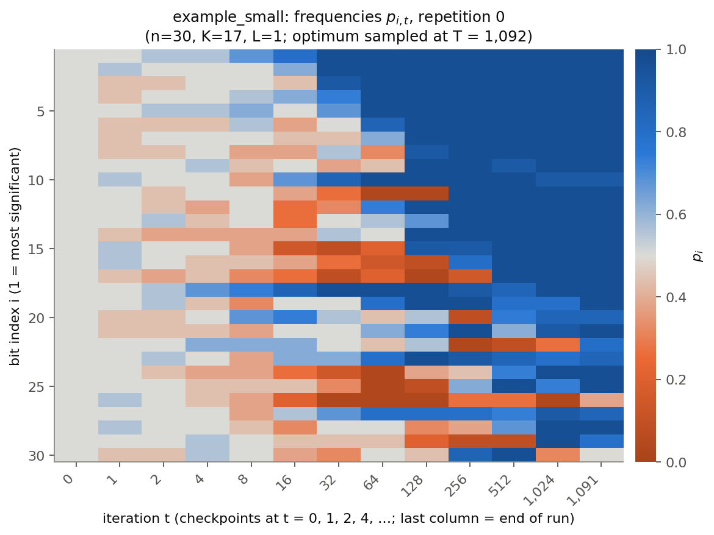
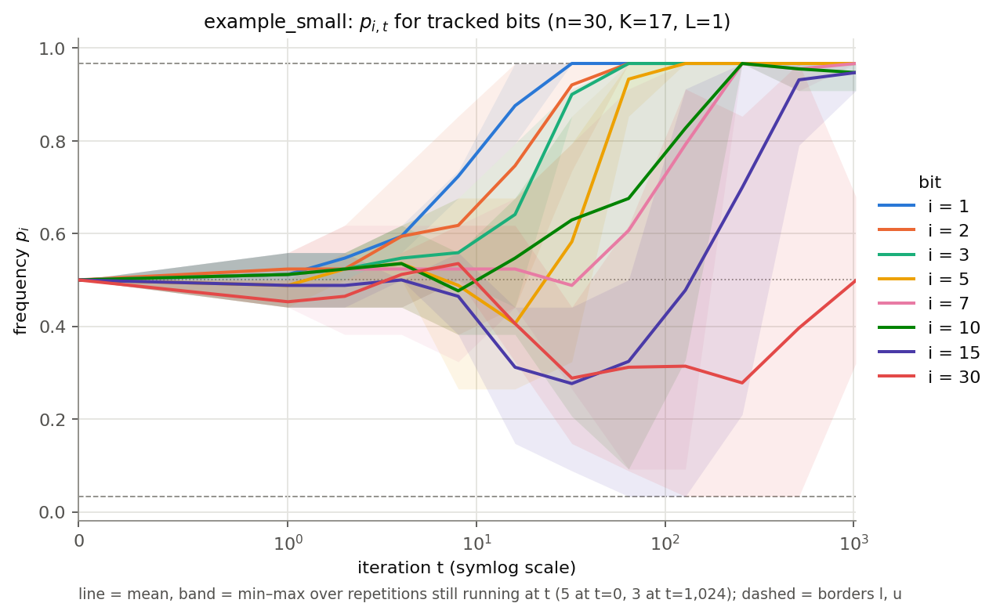
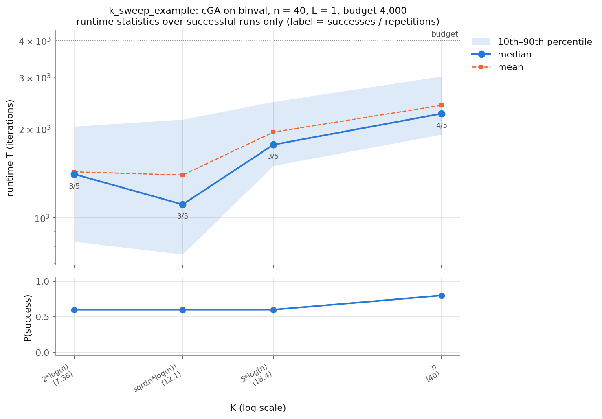

# cGA simulator: compact Genetic Algorithm on BinVal

A simulator for the **compact Genetic Algorithm (cGA)** on the static **BinVal** function, written
for a bachelor thesis on the runtime analysis of evolutionary algorithms (ETH Zürich). It runs
configurable experiments, records runtimes and frequency trajectories, and produces the plots
automatically. It has an interactive browser UI and a command-line runner.

**The algorithm.** The frequencies start at p_i = ½. Each iteration samples two strings X and Y from
p. If either one is the all-ones optimum, the run stops with runtime T. Otherwise the winner under
BinVal is decided by the first bit where X and Y differ. Every bit where winner and loser differ moves
by 1/K toward the winner's value, and p is then clipped to the borders [1/(Ln), 1 − 1/(Ln)]. The
full specification is in the UI's *About* page and in `cga/simulator.py`.

## Quick start

Requires Python 3.10 or newer.

```bash
git clone <repository-url> cga_simulator    # or unzip the archive
cd cga_simulator
python3 -m pip install -r requirements.txt  # numpy, matplotlib, pandas, PyYAML, streamlit

streamlit run app.py                        # opens the interactive UI in the browser
```

In the UI, pick a mode in the sidebar. **About the algorithm** explains everything,
**Trajectory** and **Sweep** have forms for running new experiments, **Load from file** runs a YAML
experiment file (a template is included), and **Browse results** reopens past runs. A small
experiment takes a few seconds.

## Example output

The images below come from the tiny smoke-test settings in `experiments.yaml` (n = 30 and n = 40).
They show what the plots look like, not scientific results.

| Frequency heatmap (trajectory) | Frequency trajectories (trajectory) |
|---|---|
|  |  |

**Runtime vs K (sweep):** the top panel shows median runtime with the 10–90% band and the mean. The
label under each point is successes/repetitions. The bottom panel shows the success rate within
the budget.



## Command line

```bash
python3 run_experiments.py               # run every experiment in experiments.yaml
python3 run_experiments.py NAME          # run only the experiment called NAME
python3 run_experiments.py --plot-only   # replot everything from saved data, no simulation
python3 run_experiments.py NAME --fresh  # throw away NAME's saved results and rerun
python3 tests/test_simulator.py          # correctness tests (also work with pytest)
```

Options: `--config other.yaml` and `--results other_dir/`. Results go to `results/<name>/`. That
folder is not tracked by git, so every user produces their own.

## Interactive UI

```bash
streamlit run app.py        # or double-click start_ui.command (macOS)
```

The UI opens in the browser. It uses the same pipeline as the command line, so both write to the
same `results/<name>/` folders. The sidebar has five modes:

| Mode | What it does |
|---|---|
| **About the algorithm** | The cGA step by step, why BinVal is compared bit by bit, and a glossary of every symbol. |
| **Trajectory** | A form for n, K, L, repetitions, budget, seed and tracked bits. It shows derived values live (K, step size 1/K, borders l and u, worst-case time). Run it to see the heatmap, trajectories and runtime summary. |
| **Sweep** | Enter n values and K expressions (one per line). A live table shows K and 1/K for every n, plus the total number of runs and a worst-case time. Run it to see one runtime-vs-K plot per n and the summary table. |
| **Load from file** | Upload a YAML experiment file, or use the project's `experiments.yaml`. It validates every entry, shows an overview table, and lets you choose which experiments to run. |
| **Browse results** | Reopen the plots, tables and exact configuration of any earlier experiment, whether it was run from the UI or the terminal. |

- **Experiment files**: `experiment_template.yaml` is a fully commented template for *Load from
  file*, with one experiment of each type. You can also download it from inside the UI.
- **Saving a form**: in the Trajectory and Sweep modes you can download the form as a YAML entry, or
  append it to `experiments.yaml`. Appending refuses duplicate names and keeps your comments.
- **Saved configuration**: a run started from the UI also saves its exact configuration as
  `results/<name>/experiment.yaml`.
- **Interrupting**: changing an input during a run stops it, because Streamlit reruns the page.
  Finished repetitions are already saved and are reused on the next run.

## Layout

| File | Contents |
|---|---|
| `cga/simulator.py` | `run_cga(n, K, L, comparator, max_iterations, rng, log_checkpoints)`, the cGA loop. Returns a `RunResult(converged, runtime, iterations, checkpoint_times, checkpoint_p)`. |
| `cga/comparators.py` | `binval_comparator(X, Y) -> (W, L) \| None` and a registry of comparator factories (`onemax` and `dynamic_binval` are stubs for now). |
| `cga/experiments.py` | Config parsing, `run_instance(spec)` (one seeded, side-effect-free run), and the trajectory and sweep drivers. |
| `cga/plotting.py` | All figures. |
| `cga/expressions.py` | Evaluates expressions such as `"5*log(n)"`. |
| `run_experiments.py` | Command-line entry point. |
| `app.py`, `start_ui.command` | Interactive UI (Streamlit). |
| `experiment_template.yaml` | Commented template for experiment files. |

### Algorithm conventions (as implemented)

- p⁽⁰⁾ = ½. In iteration t = 1, 2, …, X and Y are sampled from p⁽ᵗ⁻¹⁾. If either one is all-ones,
  the run stops with **T = t**. Otherwise the comparator decides, and a tie (X == Y) leaves p
  unchanged. Then `p += (W − L)/K`, clipped to `[1/(L n), 1 − 1/(L n)]`.
- BinVal is compared lexicographically, never as an integer. Bit 1 (array index 0) is the most
  significant. The tests check this exhaustively against exact Python-integer BinVal for n ≤ 6,
  and on random pairs for n up to 300.
- A run that has not sampled the optimum after `max_iterations` iterations is recorded as not
  converged.

## Adding an experiment

Append an entry under `experiments:` in `experiments.yaml` and run
`python run_experiments.py <name>`. Names must be unique, and each experiment writes its output to
`results/<name>/`. Unknown or missing keys cause an error before anything runs, which catches
typos.

The entries `K` and `K_values` accept either a number or a Python expression in `n`. Available
names: `log` (natural log), `ln`, `log2`, `log10`, `sqrt`, `exp`, `floor`, `ceil`, `min`, `max`,
`pi`, `e`. The optional `fitness:` defaults to `binval`.

**Trajectory** (one (n, K, L) setting, frequencies over time):

```yaml
  - name: my_trajectory
    type: trajectory
    n: 200
    K: "5 * log(n)"
    L: 1.0
    repetitions: 5
    max_iterations: 2000000
    seed: 42                     # repetition r uses seed + r
    track_indices: [1, 2, 3, 5, 10, 50, 100, 200]  # optional; default {1,2,3,5,10,n//4,n//2,n}
    heatmap_repetition: 0        # optional; which repetition the heatmap shows
```

**Sweep** (runtime vs K; only T is recorded):

```yaml
  - name: my_sweep
    type: sweep
    n: [200, 500]
    K_values: ["2*log(n)", "5*log(n)", "sqrt(n*log(n))", "0.3*n", "n"]
    L: 1.0
    repetitions: 10
    max_iterations: 2000000
    seed: 42                     # repetition r uses seed + r
```

## Outputs

**`results/<trajectory name>/`**
- `rep_XXX.npz`: one file per repetition, with keys `times`, `p` (checkpoints × n), `converged`,
  `runtime` (−1 if not converged), `iterations`, `wall_seconds`, and `spec` (JSON of the exact
  parameters). Load one with `cga.experiments.load_rep(path)`.
- `summary.txt` / `summary.json`: the number of converged runs, and min/median/max runtime over
  the converged runs.
- `heatmap.png/.pdf`: p_{i,t} for one repetition. Rows are bits (bit 1 at the top) and columns are
  checkpoints. The colours diverge from grey at ½ toward orange (0) and blue (1).
- `trajectories.png/.pdf`: p_{i,t} for the tracked bits. The line is the mean and the band is the
  min–max over repetitions.

Checkpoints are recorded at t = 0, 1, 2, 4, 8, …, plus once more at the end of the run: at t = T−1
(the distribution the optimum was sampled from), or at t = max_iterations if the run did not
converge. The trajectory plot averages only the doubling-grid checkpoints, and at each t it uses
only the repetitions **still running at t**. The caption says how many that is.

**`results/<sweep name>/`**
- `raw_results.csv`: one row per (n, K, repetition), with `n, K_expr, K, L, fitness,
  max_iterations, seed, repetition, converged, runtime (empty if not converged), iterations,
  wall_seconds`.
- `summary.csv`: one row per (n, K), with success rate and min / p10 / median / p90 / max / mean
  runtime **over successful runs**. It also has `median_censored`, the median over *all* runs with
  failures counted as +∞. That value is unaffected by the budget cut-off, but it is only defined
  (non-NaN) when more than half of the runs succeeded.
- `runtime_vs_K_n<n>.png/.pdf`: one figure per n. The top panel shows the median (line), the
  10th–90th percentile band and the mean (dashed), with K and T both on log axes. Each median
  marker is labelled `successes/repetitions`. The bottom panel shows the empirical success
  probability.

Percentiles use numpy's default linear interpolation.

## Resuming and parallelism

- **Sweeps** append each finished instance to `raw_results.csv` straight away (with a flush after
  each row). Rerunning skips every instance whose key (n, K_expr, L, fitness, max_iterations, seed,
  repetition) is already in the file. An interrupted sweep therefore resumes where it stopped, and
  adding a K value or n to the config only runs the new combinations. Rows whose key does not match
  the current config stay in the CSV, but they are left out of the summary and plots.
- **Trajectories** reuse `rep_XXX.npz` when its stored `spec` matches the current config exactly.
- Each run is `run_instance(InstanceSpec) -> RunResult`, and both types are picklable. To
  parallelize, map `run_instance` over `sweep_tasks(cfg)` with a `ProcessPoolExecutor` and write
  the rows in the parent process.

## Seeding

Repetition r uses `numpy.random.default_rng(seed + r)` in both experiment types. In a sweep, this
means the same seed is reused across all K values and all n. These are *common random numbers*:
each (n, K) point is still a correct, independent-repetition estimate on its own, and differences
between K values have lower variance. If you want statistically independent points across K, give
each one a distinct seed offset.

## Performance

The loop is vectorized over bits, with one Python-level iteration per cGA step. It costs about
5 µs per iteration at n = 200 and about 12 µs at n = 1000 (measured on the development machine), so
2·10⁶ iterations take roughly 10–25 s per run.

## Design choices

- matplotlib for plots (saved as PNG and PDF), pandas + CSV for sweep tables, and compressed
  `.npz` for trajectory checkpoints.
- The trajectory band is the min–max rather than quantiles, because with about 5 repetitions
  quantiles say little.
- `L < 1` produces a warning rather than an error.
- Comparator factories take `(n, rng)` so that Dynamic BinVal can draw its per-iteration
  permutation from the run's generator. The comparator the core calls still has the signature
  `(X, Y) -> (W, L) | None`.
