# cGA simulations: the compact Genetic Algorithm on BinVal

**A simulator, an interactive app and a plotting pipeline for studying the runtime of the compact
Genetic Algorithm (cGA) on the static BinVal function.** Written for a bachelor thesis on the
runtime analysis of evolutionary algorithms at ETH Zürich.

  

<p align="center">
  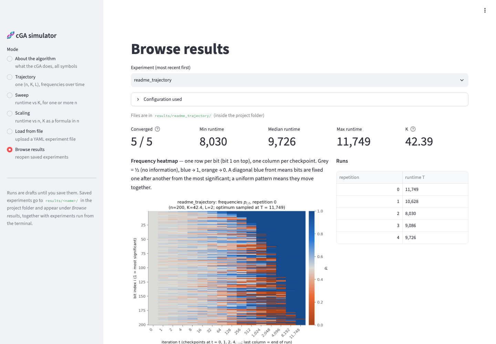
  <br><em>The app, showing a finished trajectory experiment (n = 200): runtime summary, frequency heatmap and trajectories.</em>
</p>

---

**Contents**
[Context](#context) ·
[The algorithm](#the-algorithm) ·
[What the simulator measures](#what-the-simulator-measures) ·
[The app](#the-app) ·
[Quick start](#quick-start) ·
[Command line and experiment files](#command-line-and-experiment-files) ·
[Outputs](#outputs) ·
[Correctness and implementation notes](#correctness-and-implementation-notes) ·
[Repository layout](#repository-layout)

---

## Context

The **compact Genetic Algorithm** (Harik, Lobo and Goldberg, 1999) is an
*estimation-of-distribution algorithm*. It does not keep a population. It keeps one probability
$p_i$ per bit and samples candidate solutions from that distribution. After each comparison, every
$p_i$ moves by a step of size $1/K$, where $K$ is called the *hypothetical population size*. To
stop a frequency from getting stuck at 0 or 1 for good, it is kept within the **borders**
$[\ell, 1-\ell]$.

In runtime analysis, the question is how many iterations the cGA needs until it samples the
optimum, and how that number depends on the step size $1/K$ and on the border $\ell$. **BinVal** is
a natural test case because its weights are extremely unequal:

$$\mathrm{BinVal}(x) = \sum_{i=1}^{n} 2^{\,n-i}\, x_i .$$

Bit 1 outweighs all other bits together, bit 2 outweighs everything after it, and so on. Comparing
two strings under BinVal therefore depends *only on the first bit where they differ*. The more
significant bits get a clear, strong signal. The less significant bits still get moved in every
update, but in a direction that is largely decided by bits before them. This repository makes the
effect of $K$ and of the borders on this process **visible and measurable**.

The border is parameterized as $\ell = 1/(L\,n)$ for a constant $L \ge 1$. $L = 1$ gives the
standard borders $[1/n,\, 1-1/n]$, and larger $L$ lets frequencies get closer to 0 and 1.

## The algorithm

The state is $p = (p_1,\dots,p_n)$ with $p_i = \tfrac12$ at the start. Each iteration $t = 1, 2, \dots$
does the following:

1. **Sample** $X, Y \in \{0,1\}^n$ independently, where each bit is 1 with probability $p_i$.
2. **Stop** if $X$ or $Y$ equals the optimum $1^n$. The runtime is $T = t$.
3. **Compare** them under BinVal: the first position $h$ where $X$ and $Y$ differ decides, and the
   string with a 1 there is the winner $W$. If $X = Y$, nothing changes in this iteration.
4. **Update** every bit toward the winner, then clip to the borders:

```math
p_i \;\leftarrow\; \min\Big\{\,1-\tfrac{1}{Ln},\; \max\Big\{\tfrac{1}{Ln},\; p_i + \tfrac{1}{K}\,(W_i - L'_i)\Big\}\Big\},
```

where $L'$ is the loser. So $p_i$ goes up by $1/K$ if the winner has a 1 and the loser a 0, down by
$1/K$ in the opposite case, and stays the same where the two agree.

<p align="center">
  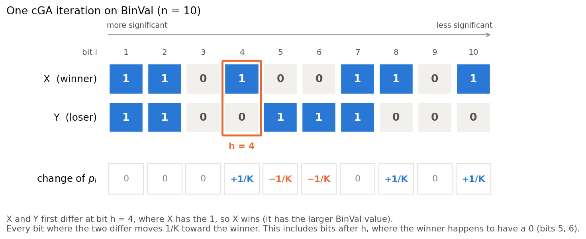
</p>

The example above shows the typical BinVal situation. Bit 4 decides the comparison, but bits 5, 6, 8
and 10 are updated too: bits 5 and 6 are pushed toward 0, only because the winner happens to have 0s
there. A run stops at the latest after a configurable budget of `max_iterations` and is then
recorded as *not converged*.

## What the simulator measures

There are three experiment types, which can be set up in a YAML file or in the app, plus live runs.

### 1. Trajectory: one setting, followed over time

The cGA runs several times with the same $(n, K, L)$. During each run the full frequency vector is
saved at $t = 0, 1, 2, 4, 8, \dots$ (doubling, so long runs stay cheap). The output is a runtime
summary and two plots:

| Frequency heatmap | Frequency trajectories |
|---|---|
|  |  |
| Each row is one bit (bit 1 on top) and each column is one checkpoint in time. Grey means $p_i = \tfrac12$, blue means close to 1, orange means close to 0. Here the bits are fixed at 1 roughly **in order of significance**, which shows as a diagonal front, while less significant bits are still pushed around, often toward 0. | $p_i$ over time for selected bits. The line is the mean and the band is the min–max over repetitions. Bit 1 converges first and bit 200 last. The dashed lines are the borders. |

*Illustrative example: n = 200, K = 8 ln n ≈ 42, L = 2, 5 repetitions.*

### 2. Sweep: runtime as a function of K

For every combination of $n$ and $K$, the cGA runs a number of independent times and records only
the runtime. Runtimes are heavy-tailed, and runs can hit the budget, so the plots show
**median and 10th–90th percentile** instead of mean ± standard deviation, together with the
**success rate** within the budget:

<p align="center">
  
</p>

The runtime statistics include only the runs that finished. The label under each point, for
example "10/10", tells how many runs that is, and the bottom panel shows the same fraction. That way
a K value where most runs never finish cannot look deceptively fast. The raw numbers for every
single run are saved as CSV, so plots can be redone without re-simulating.

*Illustrative example: n = 100, L = 2, 10 repetitions per K, budget 30 000 iterations. The parameter
values in these examples are only for demonstration.*

A sweep with two or more values of $n$ also produces the runtime-vs-n figure described in the next
section. For a proper study of the growth in $n$, the scaling type is the better fit.

### 3. Scaling: runtime as a function of n

Each $K$ is given as a formula in $n$, for example `5*log(n)`, and is re-evaluated at every $n$. The
$n$ values are usually a geometric range such as 50, 100, 200, 400, 800. The main plot shows the
median runtime against $n$ on a **log-log** scale, where polynomial growth $T \approx c\,n^{b}$ is
a straight line with slope $b$. The simulator fits $b$ by least squares for each formula.

| Runtime vs n, with fitted exponents | Normalized: T / (n ln n) |
|---|---|
| 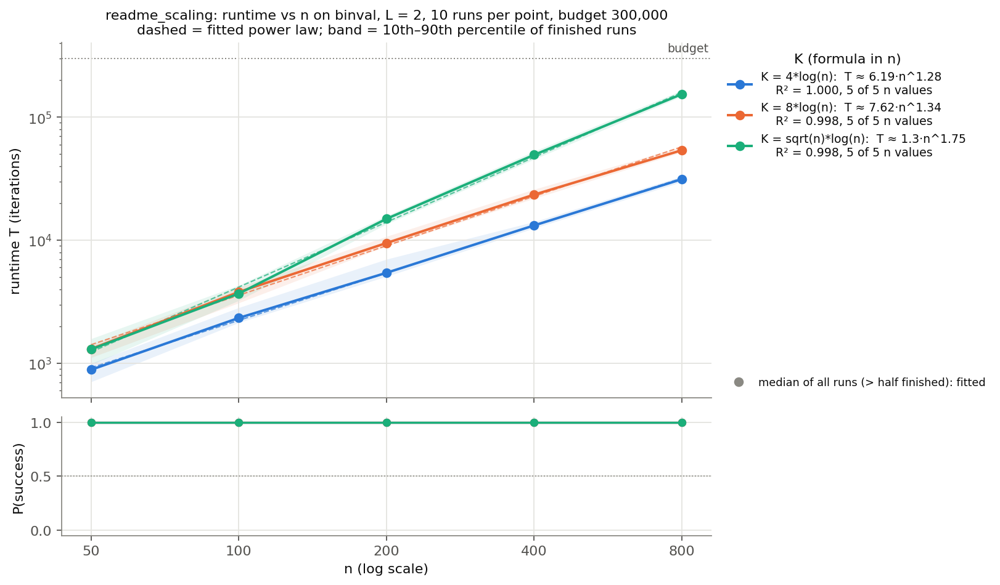 | 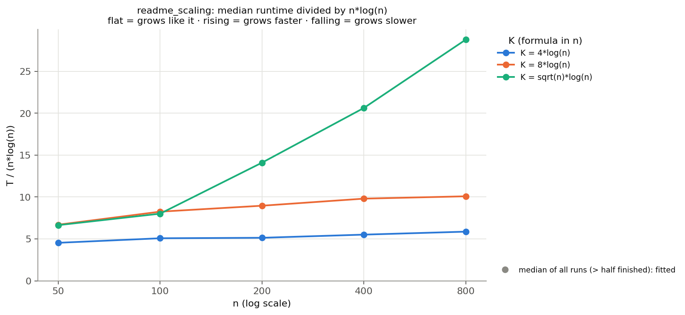 |
| One line per K formula, and the dashed line is the fitted power law. The legend gives $b$, $R^2$ and how many $n$ values entered the fit. The bottom panel shows the success rate. | Runtime divided by a chosen reference $f(n)$. A flat curve means $T$ grows like $f(n)$, a rising one faster, a falling one slower. This is often easier to judge than a slope. |

*Illustrative example: n = 50 … 800, L = 2, 10 repetitions per point.*

**The fit is not biased by the budget.** Where some runs hit the budget, the median over the
finished runs alone is too small, and so would be the exponent. The fit therefore uses the median
over *all* runs, with unfinished runs counted as +∞. That median is exact whenever more than half of
the runs finished. At $n$ values where at most half finished, the point is drawn hollow and left
out of the fit. The exponents are also saved in `scaling_fits.csv`. Treat $b$ as meaningful only with
several $n$ values over a reasonable range: two points always fit a line perfectly, and the plot
says so when that happens.

### 4. Live: watch one long run as it happens

For runs that take hours or days, the **Live** page starts a single run in a background process and
shows it while it runs. Each frequency vector is a row of colours (bit 1 on the left, orange = 0,
grey = ½, blue = 1), and time flows downward:

<p align="center">
  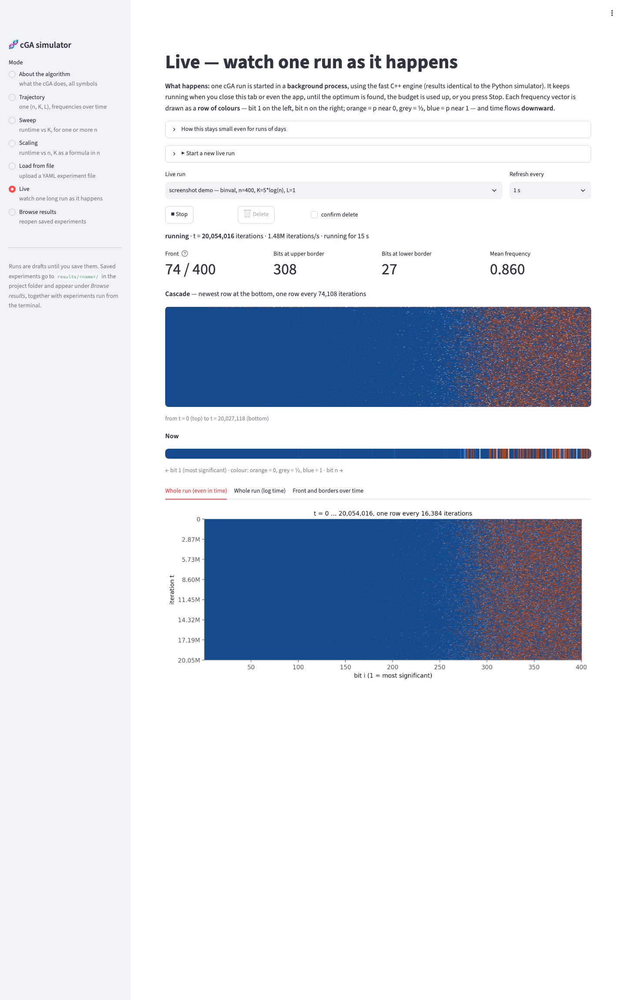
  <br><em>A live run (n = 400, K = 5 ln n, L = 1) after 24 million iterations: the current row, the cascade of recent rows, and the whole run so far.</em>
</p>

Memory stays at a few MB however long the run takes, because nothing is stored per iteration:
- **Now:** the current frequencies, refreshed a few times per second.
- **Cascade:** the most recent rows, one every *k* iterations; *k* adapts to the chosen number of
  rows per second.
- **Whole run:** at most about 2000 rows at evenly spaced times. When it is full, every other row is
  dropped and the spacing doubles, so it always covers t = 0 to now.
- **Log time:** rows at t = 1, 2, 3, … and then 8 per doubling, so the early phase stays visible.
- **Front:** the number of leading bits at the upper border, plus the number of bits at each border,
  as curves over time.

The runner is independent of the browser and of the app: it keeps going when they are closed. Its
exact state (frequencies and random-number state) is saved every minute and on Stop, and **Resume**
continues exactly as if the run had never been interrupted. A test checks that a stopped and
resumed live run ends with the same runtime as an uninterrupted one.

## The app

`streamlit run app.py` opens a local web app. Everything is explained on the page itself, and every
input has a help tooltip.

| | |
|---|---|
| 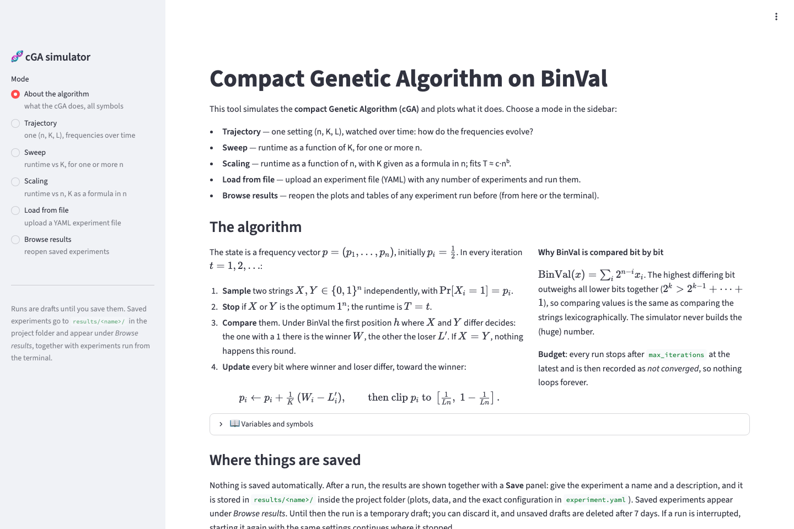 | 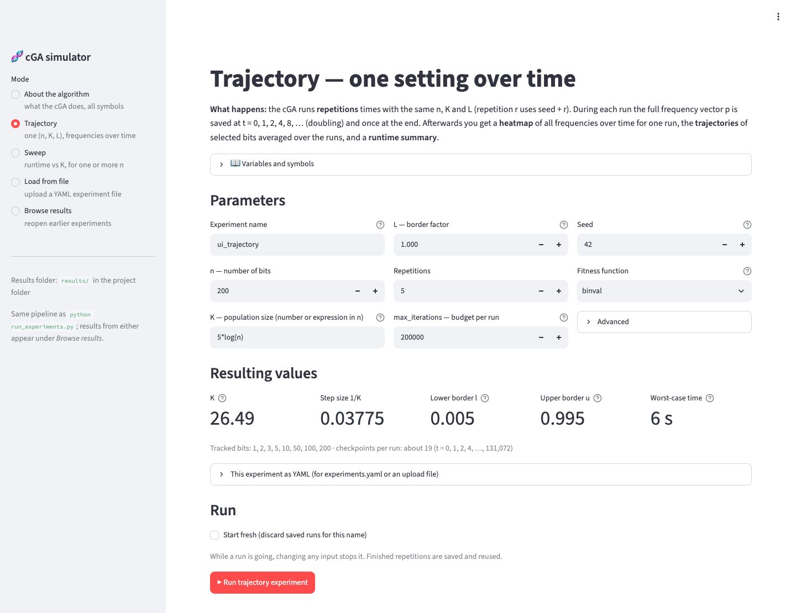 |
| **About the algorithm.** The cGA step by step, why BinVal reduces to the first differing bit, and a glossary of all symbols. | **Trajectory mode.** Parameters on top, and derived values (K, step size 1/K, borders, worst-case time) update as you type. Invalid input is explained, not crashed on. |
| 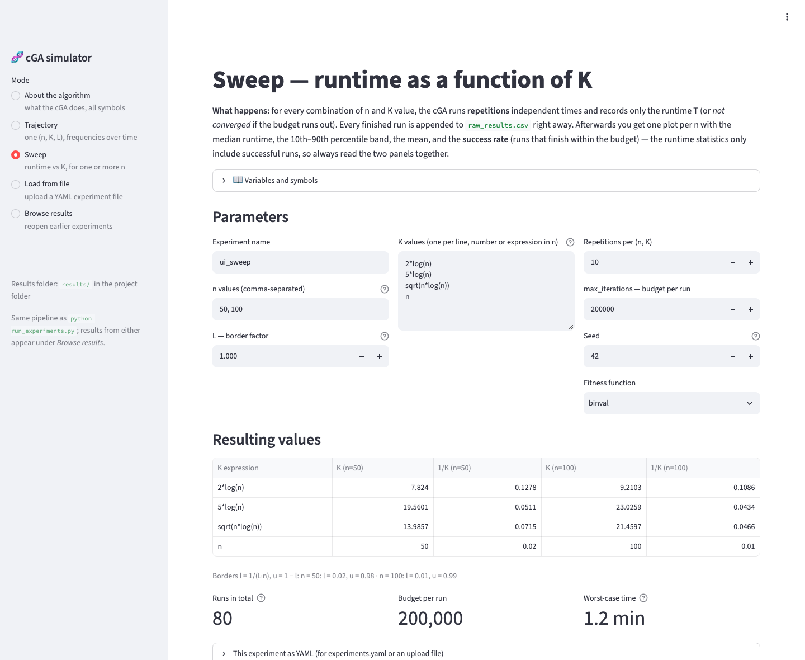 | 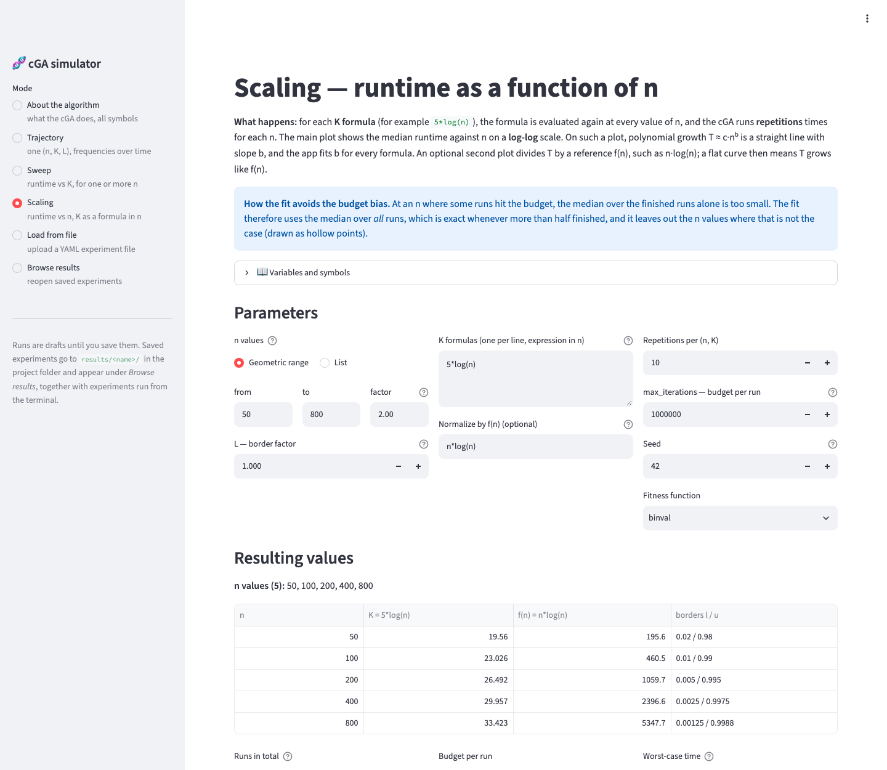 |
| **Sweep mode.** Enter n values and K expressions (for example `5*log(n)`, `sqrt(n*log(n))`, `0.3*n`). A table shows the resulting K for every n before anything runs. | **Scaling mode.** Choose n as a geometric range or a list, one or more K formulas, and optionally f(n) for the normalized plot. A table shows K and f(n) at every n, and the page warns when there are too few n values for a reliable fit. |
| 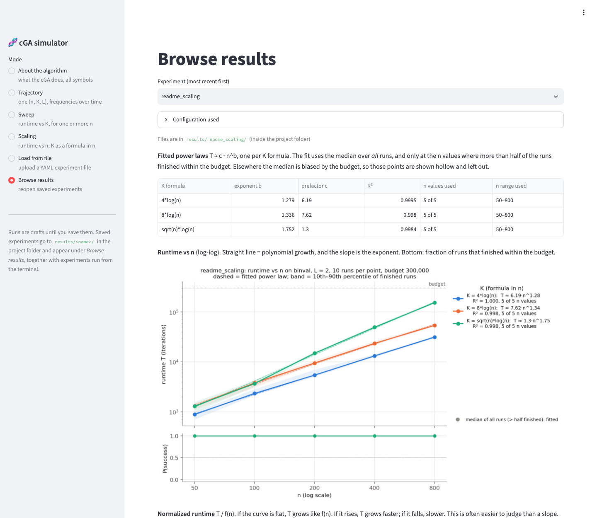 | 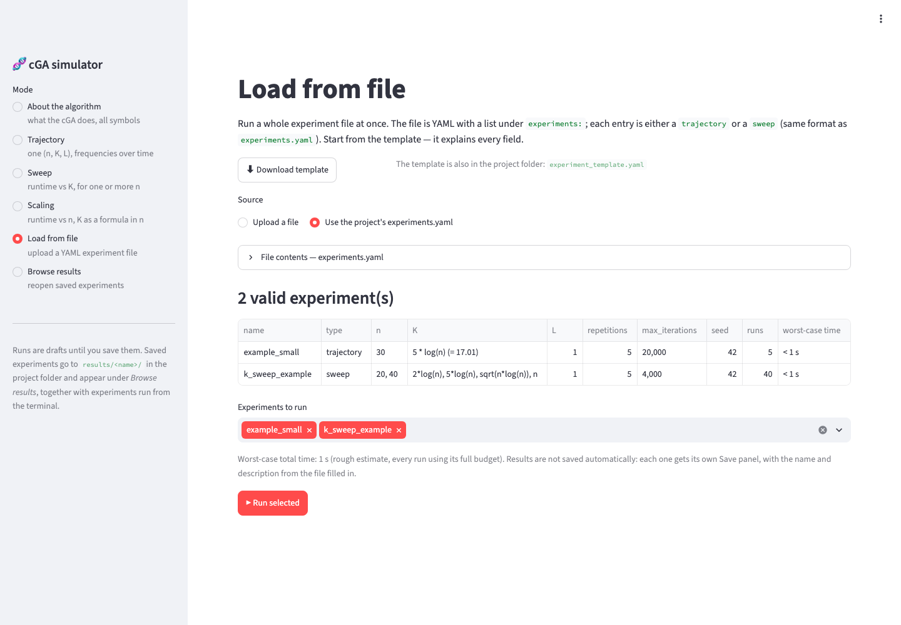 |
| **Scaling results.** A table of the fitted exponents, then the log-log plot, the normalized plot and the summary table. | **Load from file.** Upload a YAML experiment file (a commented template is included) or use `experiments.yaml`. Every entry is validated and summarized, and you choose which ones to run. |

**Parallel workers.** Every experiment form has a *Parallel workers* field next to *Repetitions*.
It sets how many separate OS processes run the repetitions at the same time; the default is all
CPUs but one. Opening a second browser tab of the app does **not** add parallelism, because both
tabs share one Python process. To run two experiments fully independently, start the second one
from a terminal with `run_experiments.py`.

**Saving is manual.** A run started in the app is a temporary draft. Below its results, a
**Save** panel asks for a **name** and a **description**, for example what the experiment is for or
what you observed. Saving stores everything in `results/<name>/`. You can also **discard** the run,
and unsaved drafts are deleted after 7 days. If a run is interrupted, starting it again with the
same settings continues where it stopped.

**Browse results** (shown at the top of this page) reopens any saved experiment, whether it was run
from the app or from the terminal, with its description and exact configuration.

<details>
<summary>Sweep results in the app</summary>

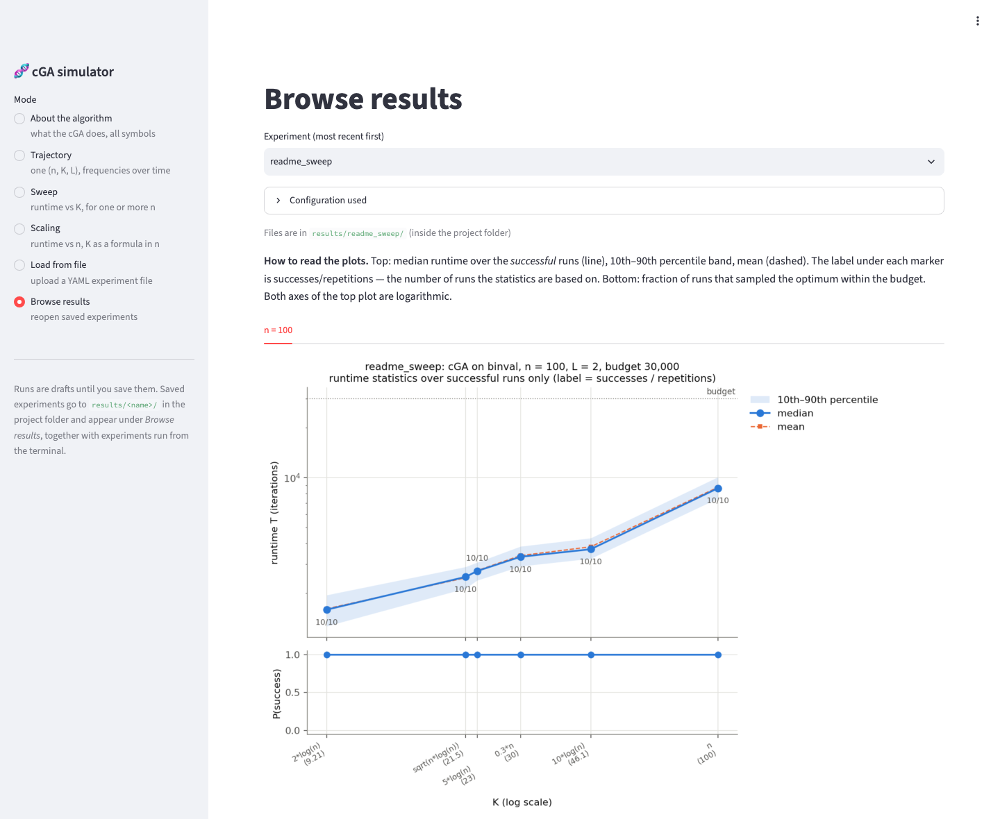
</details>

## Quick start

Requires Python 3.10 or newer, and a C++ compiler for the fast engine (on macOS:
`xcode-select --install`; without one, everything still works, just slower).

```bash
git clone https://github.com/MihneaStefanDAVID/cga-simulations.git
cd cga-simulations
python3 -m pip install -r requirements.txt   # numpy, matplotlib, pandas, PyYAML, streamlit

streamlit run app.py                         # opens the app in the browser
```

On macOS you can also double-click `start_ui.command`. A small experiment (n = 200, a few
repetitions) finishes in seconds.

To check the implementation:

```bash
python3 tests/test_simulator.py              # or: pytest tests/
```

## Command line and experiment files

Everything the app does is also available from the terminal, for long runs or scripts:

```bash
python3 run_experiments.py                   # run every experiment in experiments.yaml
python3 run_experiments.py NAME              # run only the experiment called NAME
python3 run_experiments.py --config my.yaml  # use another experiment file
python3 run_experiments.py --plot-only       # replot from saved data, no simulation
python3 run_experiments.py NAME --fresh      # discard NAME's saved results and rerun
python3 run_experiments.py --workers 8       # 8 parallel worker processes (default: CPUs - 1)
```

An experiment file is a list under `experiments:`. The commented template
[`experiment_template.yaml`](experiment_template.yaml) explains every field. In short:

```yaml
experiments:
  - name: my_trajectory
    description: "What this experiment is for"   # optional
    type: trajectory
    n: 200
    K: "5 * log(n)"          # number or expression in n (log = natural log)
    L: 1.0                   # borders l = 1/(L n), u = 1 - l
    repetitions: 5
    max_iterations: 2000000
    seed: 42                 # repetition r uses seed + r
    # optional: track_indices: [1, 2, 3, 5, 10, 50, 100, 200], heatmap_repetition: 0

  - name: my_sweep
    type: sweep
    n: [200, 500]
    K_values: ["2*log(n)", "5*log(n)", "sqrt(n*log(n))", "0.3*n", "n"]
    L: 1.0
    repetitions: 10
    max_iterations: 2000000
    seed: 42

  - name: my_scaling
    type: scaling
    n: {from: 100, to: 3200, factor: 2}   # or {from, to, count}, or a list
    K_values: ["5*log(n)", "sqrt(n)*log(n)"]
    L: 1.0
    repetitions: 20
    max_iterations: 5000000
    seed: 42
    normalize_by: "n*log(n)"             # optional: extra plot of T / f(n)
```

Allowed names in expressions: `n`, `log`/`ln` (natural), `log2`, `log10`, `sqrt`, `exp`, `floor`,
`ceil`, `min`, `max`, `pi`, `e`. Unknown or missing keys are reported before anything runs.

## Outputs

Each saved experiment is a folder `results/<name>/`. Runs from the terminal are saved there
directly, and runs from the app after you click *Save*. The folder is not tracked by git, so
everyone produces their own. Every experiment folder contains `experiment.yaml`, the exact
configuration including the description, so it can be traced back and rerun.

| Experiment type | Files |
|---|---|
| **trajectory** | `heatmap.png/.pdf` and `trajectories.png/.pdf` (the plots); `summary.txt`/`.json` (converged count, min/median/max runtime); `rep_XXX.npz` (per repetition: checkpoint times, the frequency matrix, the runtime, and the exact parameters used) |
| **sweep** | `runtime_vs_K_n<n>.png/.pdf` (one figure per n); `runtime_vs_n.png/.pdf` (only when the sweep has ≥ 2 values of n); `raw_results.csv` (one row per run: n, K, seed, converged, runtime, wall time, …); `summary.csv` (per (n, K): success rate, min/p10/median/p90/max/mean runtime, and `median_censored`) |
| **scaling** | `runtime_vs_n.png/.pdf` (log-log with fitted power laws); `runtime_normalized.png/.pdf` (if `normalize_by` is set); `scaling_fits.csv` (per K formula: exponent b, prefactor c, R², which n values were used); `raw_results.csv` and `summary.csv` as for a sweep |
| **live** (in `results/.live/<id>/`) | `meta.json` (parameters), `live.bin` (memory-mapped store of fixed size: current row, cascade, compacted history, log-time history, metrics), `checkpoint.json` + `checkpoint_p.npy` (exact state for resuming), `runner.log` |

The PDFs are there to go straight into LaTeX. `median_censored` is the median over *all* runs, with
unfinished runs counted as +∞. Unlike the median over successful runs, it is not biased by the
budget, and it is defined whenever more than half of the runs finished.

## Correctness and implementation notes

- **BinVal is never computed as a number.** At n = 1000 that would be a 1000-bit integer. The
  comparator finds the first differing bit with one vectorized `argmax`. The tests check it against
  exact Python-integer BinVal on **all** pairs of strings for n ≤ 6, and on random pairs for n up
  to 300.
- **The update rule is tested exactly** with scripted random numbers: ±1/K steps, clipping to the
  borders, and ties leaving p unchanged. Further tests cover the budget cap, reproducibility from
  the seed, and frequencies staying within the borders.
- **The fitness function is pluggable.** The core loop only calls `comparator(X, Y) -> (winner,
  loser) | None`. Other fitness functions are added as comparators in `cga/comparators.py`.
- **Fast C++ engine, identical results.** By default every run uses a C++ kernel
  (`cga/kernel/cga_kernel.cpp`). It reproduces numpy's random-number stream exactly (PCG64, the
  generator behind `np.random.default_rng`) and performs the same floating-point operations, so for
  the same seed it gives **bit-for-bit the same results** as the Python simulator: the same runtime
  and the same frequency vectors at every checkpoint. The tests check this for BinVal and OneMax. It
  is compiled automatically on first use, which needs a C++ compiler (on macOS:
  `xcode-select --install`); without one, the Python implementation is used. `CGA_ENGINE=python`
  forces Python, and `CGA_ENGINE=cpp` requires C++. Measured time per iteration:

  | n | Python | C++ | speedup |
  |---|---|---|---|
  | 50 | 4.3 µs | 0.08 µs | 52× |
  | 200 | 5.5 µs | 0.32 µs | 17× |
  | 1280 | 13.8 µs | 2.0 µs | 6.8× |
  | 5000 | 40.5 µs | 8.5 µs | 4.8× |

  At large n most of the remaining time is spent generating random numbers, which is the price of
  staying identical to numpy.
- **Parallel.** Each run is a single side-effect-free function, `run_instance(spec)` in
  `cga/instance.py`. With `workers > 1`, the runs of an experiment execute on a pool of separate
  OS processes (`ProcessPoolExecutor`, spawn start method). They are processes, not threads: the
  simulation is pure Python and holds the GIL, so threads, or two browser tabs of the same app,
  would only take turns on one core. The number of workers comes from the app's
  **Parallel workers** field, or `--workers N` on the command line, or an optional `workers:` key in
  the experiment file (in that order of precedence). The default is all CPUs but one, and values
  above the CPU count are capped. **Results do not depend on it:** the tests check that parallel and
  sequential runs produce identical rows. On a Mac with 4 performance and 6 efficiency cores, 8
  workers ran a sweep about 3.6× faster.
- **Resumable.** Every finished run is written to disk immediately, to `raw_results.csv` or
  `rep_XXX.npz`, including in parallel mode, where results arrive in completion order. When
  restarted, finished runs are skipped. An interrupted experiment therefore continues where it
  stopped, and adding K values only runs the new ones. On Ctrl-C, or when an input changes in the
  app, queued runs are cancelled instead of awaited.
- **Seeding.** Repetition r uses seed + r for every n and K (common random numbers across K). Every
  run can be reproduced from its seed.

## Repository layout

```
cga/
  simulator.py      the cGA loop: run_cga(n, K, L, comparator, max_iterations, rng, log_checkpoints)
  instance.py       one run as a unit of work: InstanceSpec, run_instance() (what worker processes run)
  kernel/           the C++ engine (cga_kernel.cpp) and its ctypes binding; compiled automatically
  live.py           live runs: background runner, constant-size memory-mapped store, stop/resume
  comparators.py    BinVal comparator and the registry for other fitness functions
  experiments.py    config parsing, run_instance(), trajectory / sweep / scaling drivers (resumable)
  plotting.py       all figures
  analysis.py       power-law fits T ~ c * n^b (budget-unbiased)
  expressions.py    evaluation of expressions such as "5*log(n)"
app.py              the interactive app (Streamlit)
run_experiments.py  command-line runner
experiments.yaml            small example experiments (smoke tests)
experiment_template.yaml    commented template for your own experiment files
tests/              correctness tests
docs/               README figures, and scripts to regenerate them (make_figures.py, take_screenshots.py)
```

---

<sub>Author: Mihnea Stefan David. Bachelor thesis, ETH Zürich, 2026. References: G. R. Harik, F. G.
Lobo, D. E. Goldberg, "The compact genetic algorithm", *IEEE Transactions on Evolutionary
Computation* 3(4), 1999. S. Droste, "A rigorous analysis of the compact genetic algorithm for linear
functions", *Natural Computing* 5(3), 2006.</sub>
